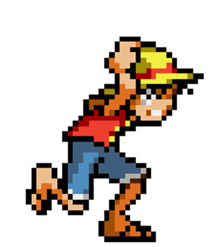

<table border="0" cellspacing="0" cellpadding="0">
  <tr>
    <td style="border: none; padding: 0;">
      
    </td>
    <td width="100%" style="border: none; padding: 0;">
      
    </td>
  </tr>
</table>

 

# Hi there! 👋 I'm Padli

  
  
  
  

### 📊 My GitHub Stats:

---

### 🛠 My Skills & Tools:

### 🤝 Let's Connect:

I'm a passionate beginner developer from Indonesia 🇮🇩 currently learning how to build awesome things!
